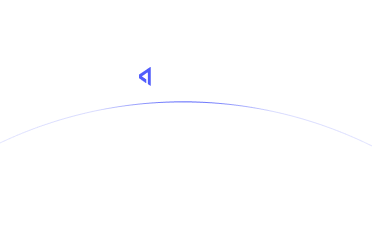

# What is Archetype?

**Archetype** is a swap aggregator that integrates derivatives, core DeFi primitives and yield under the same user-friendly platform. Users can swap to- and from any token on Arbitrum with an optional price protection feature for select tokens while earning XP.

Additionally, Archetype natively incorporates smart accounts for easy DeFi onboarding, social login and recovery features, and gas-free transactions. This platform is developed and designed with love for DeFi veterans and newbies alike, with the concrete goal of removing all inherent DeFi friction.

* [**Swap Aggregation:**](https://info-center-2) Automatically finds the best pricing for a token swap from dozens of liquidity pools across DeFi.

* [**Price Protection:** ](https://info-center-3) An optional feature that allows users to guard the tokens received in swaps against negative price action.

* [**Smart Accounts:**](https://info-center-4) A secure alternative to traditional browser wallets that enable social login, bundled transactions, and other seamless user operations.

  

> :shield: **The Archetypical DeFi Protocol:**
> Archetype will integrate more DeFi primitives throughout its development cycle. Eventually, the protocol will mature into the archetypical, interoperable, and composable all-in-one DeFi onboarding hub.
